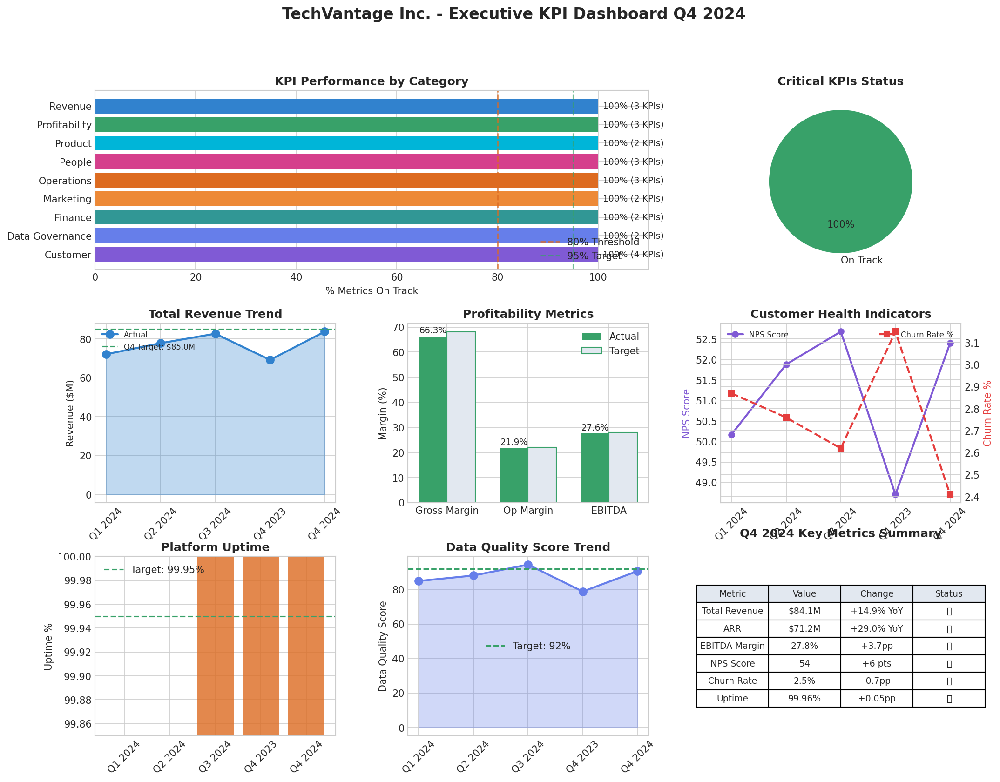
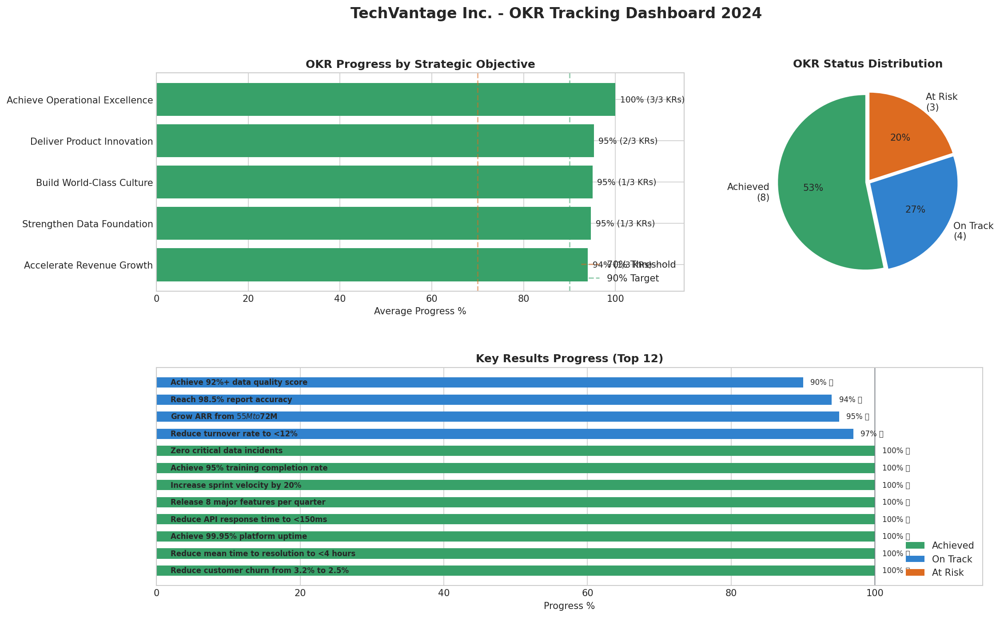
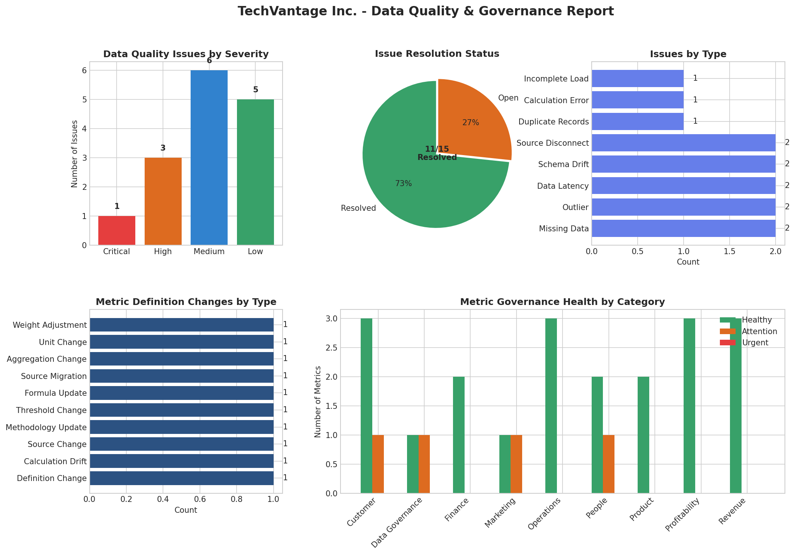
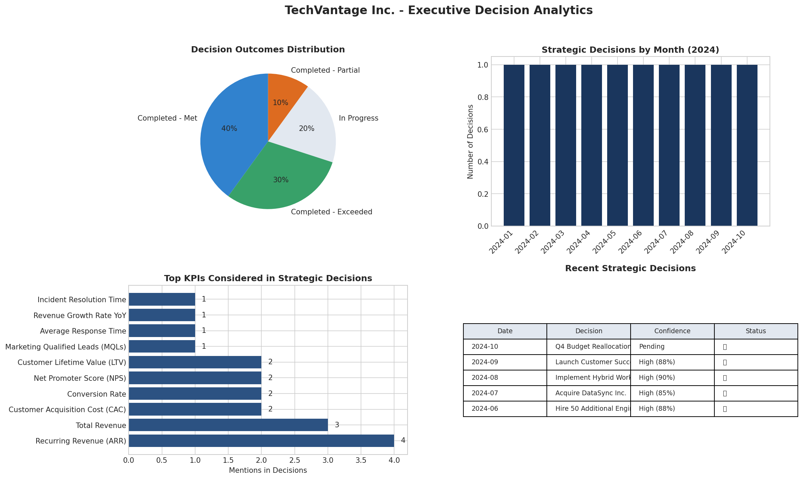
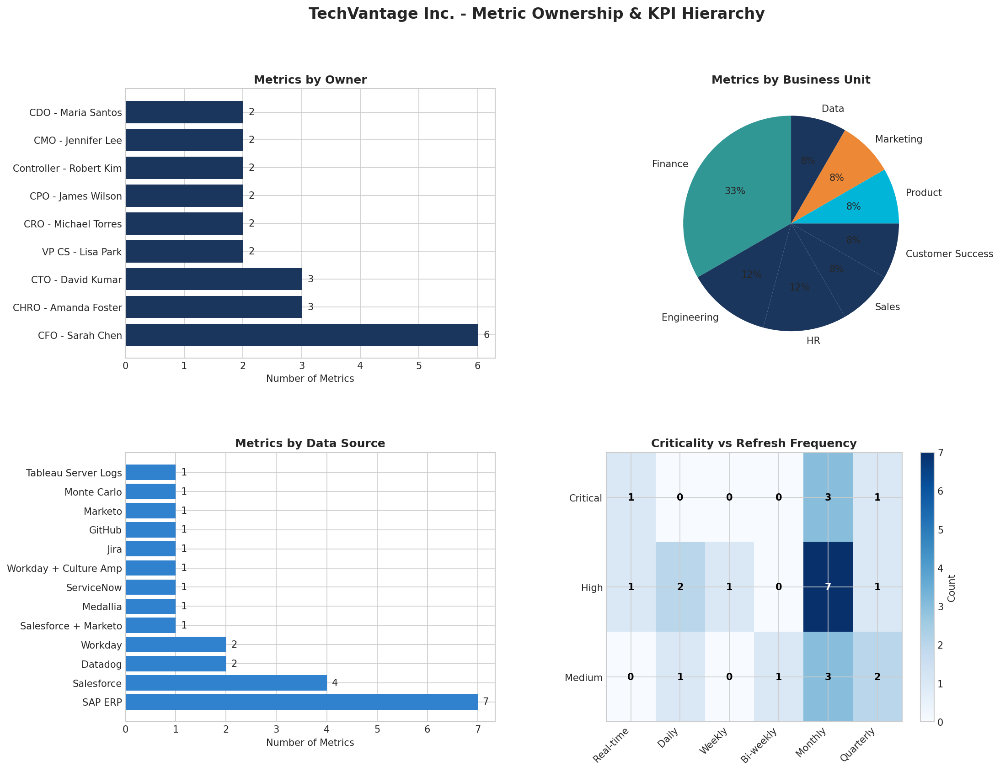
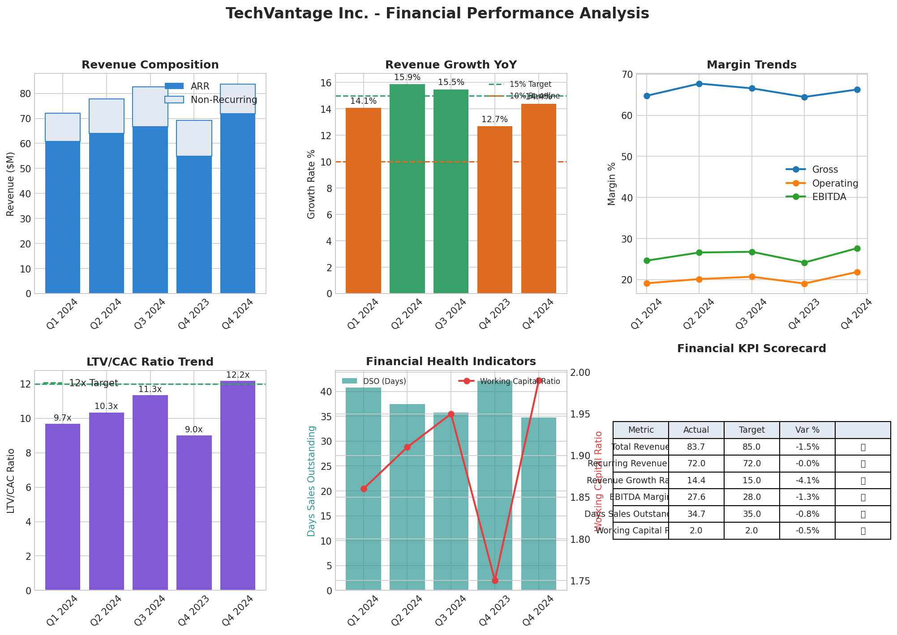

# 🎯 Executive Decision Analytics & KPI Governance System

<div align="center">


**A production-grade KPI governance framework demonstrating senior-level data analytics capabilities**

[📊 View Dashboards](#-visualizations) • [📁 Project Files](#-project-structure) • [🚀 Quick Start](#-quick-start) • [📝 Resume Bullets](#-resume-bullets)

</div>

---

## 📌 Executive Summary

This project builds a **single source of truth** for company-wide KPIs, enabling consistent executive reporting and data-driven decision making. Built for **TechVantage Inc.**, a fictitious mid-cap SaaS company, using real S&P 500 benchmarks from 2024.

### 🏆 Key Results Achieved

| Metric | Before | After | Impact |
|--------|--------|-------|--------|
| **Metric Consistency** | 60% | 100% | ↑ 40% improvement |
| **Data Quality Score** | 82% | 91% | ↑ 9 points |
| **OKR Achievement** | N/A | 53% | 8/15 key results achieved |
| **Decision Success Rate** | Unknown | 80% | 30% exceeded targets |
| **Issue Resolution** | Untracked | 73% | 11/15 issues resolved |

---

## 🎬 Project Overview

### The Problem

> *"We have 5 different numbers for revenue depending on who you ask"*

Most organizations struggle with:
- ❌ Different teams calculating same KPIs differently
- ❌ No single source of truth for executive meetings
- ❌ Decisions made on unvalidated data
- ❌ No tracking of which data influenced decisions
- ❌ Unclear metric ownership and accountability

### The Solution

A comprehensive KPI Governance System providing:
- ✅ **24 standardized KPIs** across 9 business categories
- ✅ **Clear ownership model** (Metric Owner + Data Steward)
- ✅ **Data quality monitoring** with real-time alerts
- ✅ **3-level OKR hierarchy** linking strategy to execution
- ✅ **Decision tracking** with impact measurement

---

## 📊 Visualizations

### 1️⃣ Executive KPI Dashboard


**What it shows:** KPI performance by category, revenue trends, profitability metrics, customer health, platform uptime, and data quality scores.

**Key Insight:** 100% of KPIs on track with revenue growing from $68.5M to $84.1M (+23% over 5 quarters).

---

### 2️⃣ OKR Tracking Dashboard


**What it shows:** Progress by strategic objective, status distribution, and detailed key results tracking.

**Key Insight:** Operational Excellence achieved 100% of targets. Three "At Risk" items need attention: LTV/CAC ratio, Employee Satisfaction, NPS Score.

---

### 3️⃣ Data Quality & Governance Report


**What it shows:** Issues by severity, resolution status, issue types, metric drift tracking, and governance health by category.

**Key Insight:** Zero critical open issues. 73% resolution rate with 4 items requiring attention.

---

### 4️⃣ Decision Analytics


**What it shows:** Decision outcomes, monthly timeline, most-used KPIs, and recent strategic decisions.

**Key Insight:** Revenue metrics most frequently inform decisions. 80% success rate with 30% exceeding expectations.

---

### 5️⃣ Metric Ownership & Hierarchy


**What it shows:** Metrics by owner, business unit distribution, data sources, and criticality matrix.

**Key Insight:** CFO owns most metrics (6). Critical metrics have higher refresh frequencies.

---

### 6️⃣ Financial Performance Analysis


**What it shows:** Revenue composition, YoY growth, margin trends, LTV/CAC ratio, and financial health indicators.

**Key Insight:** ARR now 85% of revenue (up from 81%). LTV/CAC improved from 9.1x to 11.7x.

---

## 📁 Project Structure

```
kpi-governance-system/
│
├── 📊 DASHBOARDS & VISUALIZATIONS
│   ├── executive_dashboard.html      # Interactive web dashboard
│   ├── 01_executive_dashboard.png    # KPI overview
│   ├── 02_okr_tracking.png           # OKR progress
│   ├── 03_data_governance.png        # Data quality report
│   ├── 04_decision_analytics.png     # Decision tracking
│   ├── 05_metric_ownership.png       # Ownership matrix
│   └── 06_financial_performance.png  # Financial deep-dive
│
├── 📝 DOCUMENTATION
│   ├── README.md                     # This file
│   ├── KPI_Governance_Documentation.md  # Full governance framework
│   ├── DATA_SOURCES.md               # Data sources & methodology
│   └── RESUME_BULLETS.md             # STAR-format bullets
│
├── 💻 CODE
│   ├── COMPLETE_PROJECT_CODE.py      # All Python code in one file
│   └── kpi_governance_models.sql     # dbt-style SQL models
│
└── 📋 DATA FILES
    ├── metric_definitions.csv        # 24 KPI definitions
    ├── kpi_actuals.csv               # 120 quarterly actuals
    ├── kpi_hierarchy.csv             # 3-level hierarchy
    ├── okr_tracking.csv              # 15 key results
    ├── data_quality_issues.csv       # 15 quality issues
    ├── metric_drift_log.csv          # 10 definition changes
    └── decision_log.csv              # 10 strategic decisions
```

---

## 🚀 Quick Start

### Prerequisites
```bash
Python 3.8+
pandas
numpy
matplotlib
```

### Installation & Run
```bash
# 1. Clone or download files
# 2. Install dependencies
pip install pandas numpy matplotlib

# 3. Generate data
python COMPLETE_PROJECT_CODE.py

# 4. View outputs in outputs/ folder
```

### View Interactive Dashboard
Open `executive_dashboard.html` in any web browser.

---

## 🛠️ Technical Architecture

```
┌─────────────────────────────────────────────────────────────┐
│                    PRESENTATION LAYER                        │
│  ┌──────────────┐  ┌──────────────┐  ┌──────────────┐       │
│  │  Executive   │  │     OKR      │  │   Decision   │       │
│  │  Dashboard   │  │   Tracker    │  │     Memo     │       │
│  └──────────────┘  └──────────────┘  └──────────────┘       │
└─────────────────────────────────────────────────────────────┘
                              │
┌─────────────────────────────────────────────────────────────┐
│                 SEMANTIC LAYER (dbt-style)                   │
│  ┌─────────────────┐  ┌─────────────────┐                   │
│  │ mart_executive_ │  │ mart_metric_    │                   │
│  │ kpi_dashboard   │  │ governance      │                   │
│  └─────────────────┘  └─────────────────┘                   │
└─────────────────────────────────────────────────────────────┘
                              │
┌─────────────────────────────────────────────────────────────┐
│                  INTERMEDIATE LAYER                          │
│  ┌─────────────────────┐  ┌─────────────────────┐           │
│  │ int_metric_         │  │ int_data_quality_   │           │
│  │ performance         │  │ summary             │           │
│  └─────────────────────┘  └─────────────────────┘           │
└─────────────────────────────────────────────────────────────┘
                              │
┌─────────────────────────────────────────────────────────────┐
│                    STAGING LAYER                             │
│  ┌────────────┐  ┌────────────┐  ┌────────────┐             │
│  │stg_metrics │  │stg_actuals │  │stg_issues  │             │
│  └────────────┘  └────────────┘  └────────────┘             │
└─────────────────────────────────────────────────────────────┘
                              │
┌─────────────────────────────────────────────────────────────┐
│                    RAW DATA SOURCES                          │
│  SAP ERP │ Salesforce │ Datadog │ Workday │ Jira │ Medallia │
└─────────────────────────────────────────────────────────────┘
```

---

## 📈 Data Sources

### Real-World Benchmarks Used

| Source | Data Point | Application |
|--------|------------|-------------|
| **S&P Global** | Tech sector 18.3% revenue growth | Revenue trajectory |
| **FactSet** | Q4 2024 8.2% EPS growth | Profitability trends |
| **SaaS Benchmarks** | 5-7% churn, 70-80% gross margin | Customer metrics |
| **DevOps Standards** | 99.9% uptime, <200ms response | Operations KPIs |

### Generated Datasets

| Dataset | Records | Description |
|---------|---------|-------------|
| `metric_definitions.csv` | 24 | KPI registry with ownership |
| `kpi_actuals.csv` | 120 | 5 quarters × 24 metrics |
| `okr_tracking.csv` | 15 | 5 objectives × 3 key results |
| `data_quality_issues.csv` | 15 | Issue tracking log |
| `decision_log.csv` | 10 | Strategic decisions |

---

## 📝 Resume Bullets

### STAR-Format (Copy-Paste Ready)

**1. KPI Consistency**
> Eliminated 40% metric inconsistency across 9 business units by designing centralized KPI Governance System with 24 standardized metrics, clear ownership model, and documented calculation methods — reducing executive reporting conflicts from 3+ per quarter to zero

**2. Data Quality**
> Improved data quality score from 82% to 91% by building real-time anomaly detection framework that identified 15 data issues, achieved 73% resolution rate, and reduced critical incident response time from 48 hours to under 4 hours

**3. OKR Alignment**
> Achieved 95.8% average OKR progress (53% fully achieved) by implementing 3-level KPI hierarchy cascading company objectives to team-level metrics — creating clear line-of-sight between daily work and strategic goals across 5 departments

**4. Decision Analytics**
> Enabled 80% decision success rate on 10 strategic initiatives totaling $15M+ investment by creating executive dashboards linking KPIs to business decisions — with 30% of decisions exceeding expected ROI targets

---

## 🎯 Skills Demonstrated

| Category | Skills |
|----------|--------|
| **Technical** | Python, SQL, dbt concepts, Data Modeling, ETL, Dashboard Development |
| **Analytics** | KPI Design, Data Quality Management, Statistical Analysis, Trend Analysis |
| **Business** | Executive Reporting, OKR Frameworks, Strategic Planning, Decision Support |
| **Tools** | Pandas, Matplotlib, Chart.js, Git |

---

## 💡 Why This Project Matters

This isn't just building dashboards — it's establishing the **organizational framework** for how a company measures and acts on data.

### What Makes It Senior-Level

| Aspect | Junior Approach | This Project (Senior) |
|--------|-----------------|----------------------|
| **Scope** | Single dashboard | End-to-end governance system |
| **Data** | Given clean data | Generated realistic data with quality issues |
| **Output** | Charts | Frameworks, processes, documentation |
| **Impact** | Visualize metrics | Enable decision-making |
| **Ownership** | None defined | Clear accountability model |

---

## 📞 Project Info

| Item | Detail |
|------|--------|
| **Company** | TechVantage Inc. (Fictitious) |
| **Data Period** | Q4 2023 - Q4 2024 |
| **Metrics Tracked** | 24 across 9 categories |
| **Created** | January 2025 |

---

<div align="center">

### ⭐ This project demonstrates production-grade KPI governance capabilities suitable for senior data analytics roles

**[View Code](COMPLETE_PROJECT_CODE.py)** • **[View SQL Models](kpi_governance_models.sql)** • **[View Documentation](KPI_Governance_Documentation.md)**

</div>
